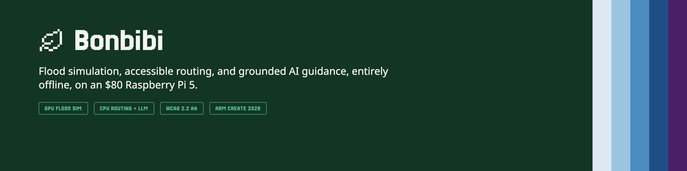
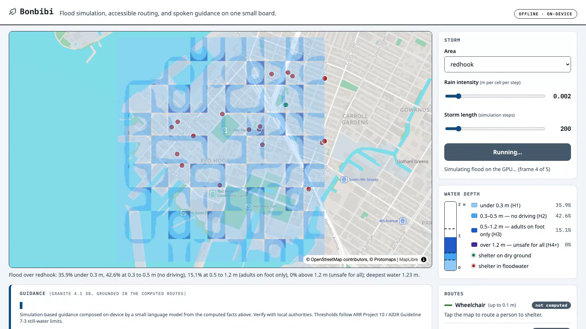
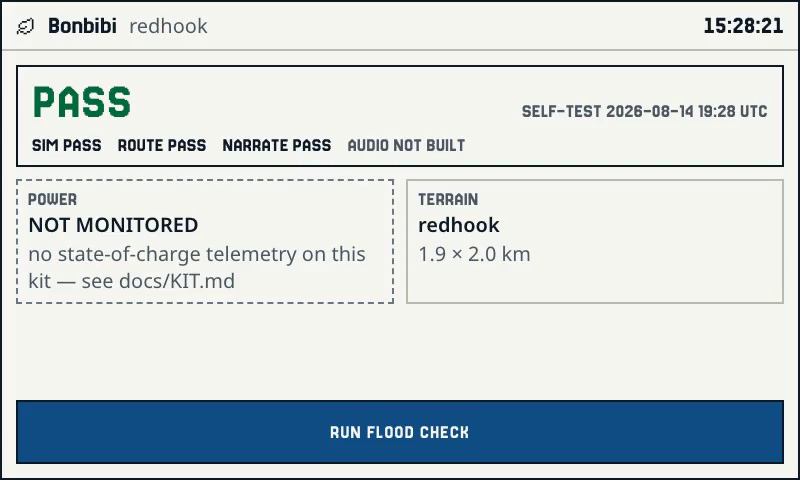

# Bonbibi

Offline flood simulation, mobility-aware shelter routing, and grounded
language guidance on one Raspberry Pi 5. The integrated GPU (Broadcom
VideoCore VII / V3D) simulates the flood while the four ARM cores run the
router and the language model, with no internet at runtime. Named after
the guardian of the Sundarbans.



Submission writeup for the Arm AI Optimization Challenge: `WRITEUP.md`.
Measured optimization ledger and literature citations: `HACKATHON.md`.
Full benchmark ledger with raw commands: `BENCHMARK_RESULTS.md`.
Hardware kit (two orderable build variants): `docs/KIT.md`.

## Idea

A Pi 5 doing CPU inference leaves its GPU idle. Bonbibi puts that idle
silicon to work as a flood co-processor: the GPU runs a physics-verified
WCA2D flood simulation over real terrain while the CPU concurrently
routes people to shelters and narrates the result. Measured concurrently
on the board: about 700 simulation steps per second on the GPU while CPU
decode keeps 90% of its solo speed.

The division of labor is deliberate: deterministic code owns every
safety-critical decision (which water is passable for whom, which shelter
is reachable, what the recommended action is), and the language model
only composes those computed facts into plain language, through Granite's
document-grounding chat template. A small model doing depth-threshold
arithmetic is a safety bug; a breadth-first search is not.

The GPU kernel is the fused, strip-mined variant found and verified by
[Seppa](https://github.com/msradam/seppa), a correctness-gated,
LLM-driven kernel optimizer: 1.59x over the original two-pass stencil,
with the speedup growing to 2.09x under concurrent CPU load.

## Mobility profiles

Thresholds are limiting still-water depths from the flood-safety
literature (ARR Project 10; AIDR Guideline 7-3; quotes and citations in
`HACKATHON.md`):

| Profile | Limit | Basis |
|---|---|---|
| Wheelchair / cannot wade | 0.1 m | no safe flow regime documented for frail or disabled persons |
| On foot | 0.5 m | ARR depth ceiling for children (conservative; able-bodied adult ceiling 1.2 m) |
| Vehicle | 0.3 m | floating depth of a small passenger car |

Vehicles become unsafe before pedestrians. The map's water bands follow
the AIDR hazard classes (H1 <0.3 m, H2 <0.5 m, H3 <1.2 m, H4+ above).

## What runs

- **Console UI** (`bonbibi_app.py` + `ui/`): FastAPI backend and a
  WCAG 2.2 AA interface (zero axe violations, keyboard-operable, live
  regions, speech output). Real offline cartography: MapLibre GL over a
  Protomaps PMTiles extract served from the Pi. Run a storm, watch the
  hazard bands drape over the real basemap, then tap anywhere to route
  that person to the nearest reachable shelter per mobility profile,
  with Granite narrating from grounded documents. Every completed run
  also emits a CAP 1.2-shaped structured alert (`status: Exercise`).
- **Terminal CLI** (`bonbibi_cli.py`): the same pipeline headless, with
  the flood raster rendered as ANSI half-blocks over SSH: shelters,
  person marker, per-profile routes, streaming guidance.
- **Street-graph router** (`router_streets.cpp`): RoutingKit CCH over a
  real OSM extract; each flood update re-customizes in ~14 ms on the Pi.
- **Live data** (`fetch_live.py`): USGS gage + Open-Meteo rainfall
  driving the simulation from real conditions.
- **Panel** (`panel/`): a second, purpose-built interface for an 800x480
  DSI touchscreen kiosk (IDLE, RUNNING, RESULT, and MAP screens), the
  same backend and physics, tuned for a small always-on physical device
  rather than a desktop browser. Bring-up notes: `panel/` and
  `docs/KIT.md`.



## Quick start (on the Pi)

One-time, online: fetch an area (elevation, basemap, shelters).

```
python3 fetch_dem.py redhook 40.667 40.685 -74.02 -73.998
python3 fetch_basemap.py dem_redhook.txt redhook     # needs the pmtiles CLI
python3 fetch_shelters.py dem_redhook.txt redhook
```

Build the flood harness (the optimized kernel) and validate the physics:

```
g++ -O3 -o vkflood2 vkflood2.cpp -lvulkan
glslangValidator -V shaders/fused2s.comp -o fused2s.spv
DEM=dem_redhook.txt RAIN=0.002 STRIP=2 FUSED=1 FLUX_SPV=fused2s.spv ./vkflood2 256 400
# expect: correct(NMSE vs CPU)=yes, conserved vs rain=yes
python3 routing.py                                    # routing self-check
```

Run (two processes; model from
[ibm-granite/granite-4.1-3b-GGUF](https://huggingface.co/ibm-granite/granite-4.1-3b-GGUF), Q4_0):

```
pip install -r requirements.txt
GGML_VK_VISIBLE_DEVICES=99 llama-server -m granite-4.1-3b-Q4_0.gguf \
    -ngl 0 -t 3 -c 4096 --jinja --cache-reuse 256 --port 8081 &
uvicorn bonbibi_app:app --host 0.0.0.0 --port 8500
```

Open `http://<pi>:8500`. Headless instead:

```
python3 bonbibi_cli.py --lat 40.681 --lon -74.01
```

llama.cpp is built CPU-only-by-design for inference (the GPU is busy with
physics); `GGML_VK_VISIBLE_DEVICES=99` hides the GPU from the inference
process. With any Vulkan device visible, llama.cpp otherwise places CPU
weights in GPU host-pinned memory even at `-ngl 0`, worth **10.6x on
prompt processing and +13.7% on decode** on the production model
(measured on the board; see `BENCHMARK_RESULTS.md` and `HACKATHON.md`).

## Sample areas

`samples/` ships DEMs and shelter candidates for Red Hook (Brooklyn),
Dhaka and Gabura/Sundarbans (Bangladesh), Beira (Mozambique), Sehwan
(Pakistan), Kuttanad (Kerala), and downtown DC. A new area anywhere on
Earth is the three fetch commands above; the offline bundle per area is
roughly 1 MB.

## Status

Works and is verified on the board: physics-gated GPU flood (NMSE vs a
double-precision reference, mass conservation), three-profile shelter
routing over the full-resolution depth field, document-grounded
narration, concurrent GPU+CPU operation with a measured interference
envelope, offline cartography, WCAG 2.2 AA console, headless CLI.

Not yet production: the flood model has no drainage or infiltration, so
absolute depths are inflated and the spatial pattern is the meaningful
output; shelter candidates come from OSM, whose completeness varies by
region (rural Sundarbans returns none; deployments need local review);
the street-graph router is demonstrated on one region and not yet wired
into the console UI; guidance is simulation-based and says so on screen.

## Evidence

Everything measured in this repo is reproducible from what's checked in,
not from a live device, since a physical kit can always be unreachable
when someone reads this:

- **Raw benchmark output**: `bench_llm_cpu.log`, `spec_decode.log`
  (actual `llama-bench`/`llama-server` stdout, not transcribed numbers).
- **Reproduction script**: `bench_llm_cpu.sh`, runnable on any Pi 5 with
  the pinned llama.cpp build.
- **Full ledger**: `BENCHMARK_RESULTS.md`, every number with its
  reproduction command next to it.
- **Screenshots**: `docs/img/`, real captures of the console and panel,
  not mockups.
- **Demo video**: attached to the Devpost submission.

## Pinned versions

llama.cpp at commit `bb28c1f` plus the four patches in the seppa repo's
`pi/` directory; Mesa v3dv 25.0.7 (Raspberry Pi OS packaging); model
`granite-4.1-3b-Q4_0.gguf` from ibm-granite/granite-4.1-3b-GGUF;
Raspberry Pi 5 16 GB (BCM2712, VideoCore VII V3D 7.1.10.2). Expected
results and tolerances for each measured claim are stated where the
claim is made (README, HACKATHON.md, and the seppa paper).

## License

MIT. See `LICENSE`.
