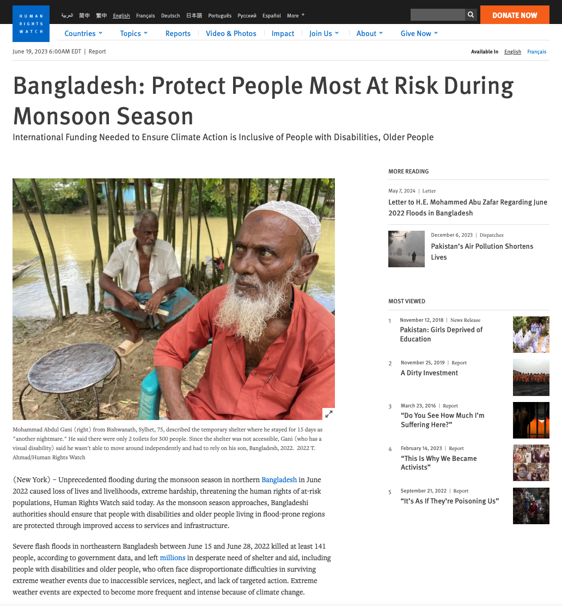

<!-- _class: title -->

<h1> Bonbibi</h1>

Flood guidance, entirely offline, on a Raspberry Pi 5.

Adam Munawar Rahman Arm Create: AI Optimization Challenge 2026, Physical AI Track

---

<!-- _class: hook -->

# When the network goes down in a flood, routing still has to work.

---

<!-- _class: stat -->

  

    
26%&rarr;39%

    
of disabled evacuees could leave immediately, with warning

  

  

    
10%&rarr;6%

    
could not evacuate at all, with warning

  

UNDRR 2023 global survey, 6,342 respondents, 132 countries

---

<!-- _class: stat -->

Warning works. <strong style="color:var(--shamrock)">Routing is the missing half</strong>, especially where connectivity fails first.

1.81 BILLION PEOPLE FACE SIGNIFICANT FLOOD RISK, 89% IN LOW- AND MIDDLE-INCOME COUNTRIES

Source: World Bank / Nature Communications, 2022

---

<!-- _class: article-shot -->

This is not a hypothetical.

Human Rights Watch, hrw.org, June 19, 2023

---

<!-- _class: case -->

What the report found

141

people killed in flash floods, June 15&ndash;28, 2022 (government data)

People with disabilities and older people died disproportionately: inaccessible shelters, warnings that never reached them.

&ldquo;We were not prepared because we did not receive any warnings.&rdquo;

Mohammad Sher Uddin, 50, disabled flood survivor, Sylhet

Source: Human Rights Watch, June 19, 2023

---

<!-- _class: transition -->

# Let's see it.

Live, on a Raspberry Pi 5, no internet

---

<!-- _class: section-head -->

How it works

# One board, two engines, running at the same time.

The GPU simulates the flood. Four Arm cores route and narrate. At the same time.

---

<!-- _class: metric -->

GPU kernel, LLM-optimized, correctness-gated

  

    
1.59x

    
steps/s over the original two-pass stencil

  

  

    
2.09x

    
that advantage grows under concurrent LLM decode

  

A finite-state machine owns compile &rarr; verify &rarr; benchmark &rarr; keep/revert. A kernel that fails physics can never produce a benchmark number.

Source: BENCHMARK_RESULTS.md

---

<!-- _class: table-slide -->

The concurrency counterfactual

<table>
<thead>
<tr><th>Condition</th><th>GPU steps/s</th><th>CPU t/s</th></tr>
</thead>
<tbody>
<tr class="win"><td>Deployment (GPU + CPU split)</td><td>712</td><td>10.3</td></tr>
<tr><td>Best CPU-only alternative</td><td>681</td><td>8.4</td></tr>
</tbody>
</table>

The split wins both axes at once, against every CPU-only alternative tested.

Source: BENCHMARK_RESULTS.md

---

<!-- _class: section-head -->

Arm-specific optimization, measured, not assumed

# Three findings that only show up when you actually benchmark the board.

---

<!-- _class: metric -->

Native repack beats Arm KleidiAI

  

    
+39.7%

    
prompt processing

  

  

    
+14.3%

    
decode

  

Cortex-A76 has no i8mm/SVE, so KleidiAI never reaches its best kernels here. llama.cpp&apos;s own repack path wins instead.

Source: HACKATHON.md

---

<!-- _class: metric -->

A real bug, found and fixed

  

    
10.6x

    
prompt processing, GPU hidden vs. visible

  

Any visible Vulkan device pins CPU weights in GPU write-combined memory, even at zero GPU layers. One environment variable fixes it.

Source: bench_llm_cpu.sh

---

<!-- _class: metric -->

Q4_0 beats every K-quant and speculative decoding

  

    
+73.9%

    
Q4_0 vs. best K-quant, prompt processing

  

  

    
6.0% slower

    
speculative decoding, rejected on measurement

  

Source: BENCHMARK_RESULTS.md

---

<!-- _class: closing -->

<h1> Bonbibi</h1>

github.com/msradam/bonbibi: MIT licensed

Arm AI Optimization Challenge 2026, Physical AI Track

